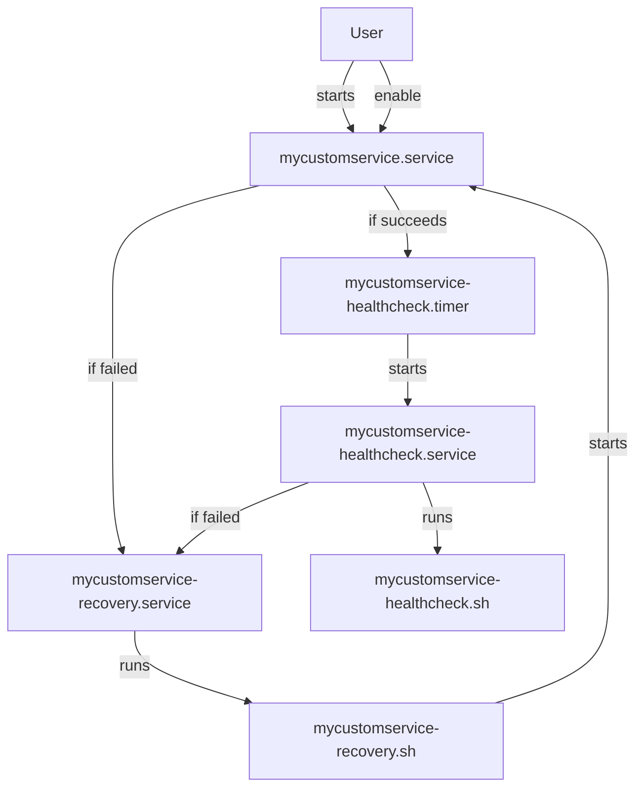

# Self-Healing Approach for services using systemd

A self-healing approach for managing complex or poorly coded services using systemd units.

The goal is to ensure optimal and efficient service operation.

## Flow chart

## systemd units

### mycustomservice.service

Responsible for starting the main service.

If startup fails, launch **mycustomservice-recovery.service** for recovery.

If startup succeeds, start **mycustomservice-healthcheck.timer**.

### mycustomservice-healthcheck.timer

Triggers **mycustomservice-healthcheck.service** every 10 minutes.

Automatically starts after successful **mycustomservice.service** startup.

### mycustomservice-healthcheck.service

Executes the **mycustomservice-healthcheck.sh** script.

If the script fails (non-zero status), initiates recovery via **mycustomservice-recovery.service**.

### mycustomservice-recovery.service

Executes the **mycustomservice-recovery.sh** script.

## Scripts

### mycustomservice-healthcheck.sh

A script implementing all necessary readiness and liveness probes to verify the health status of the service.

### mycustomservice-recovery.sh

A script implementing all necessary recovery actions to restore the service to a healthy state.
